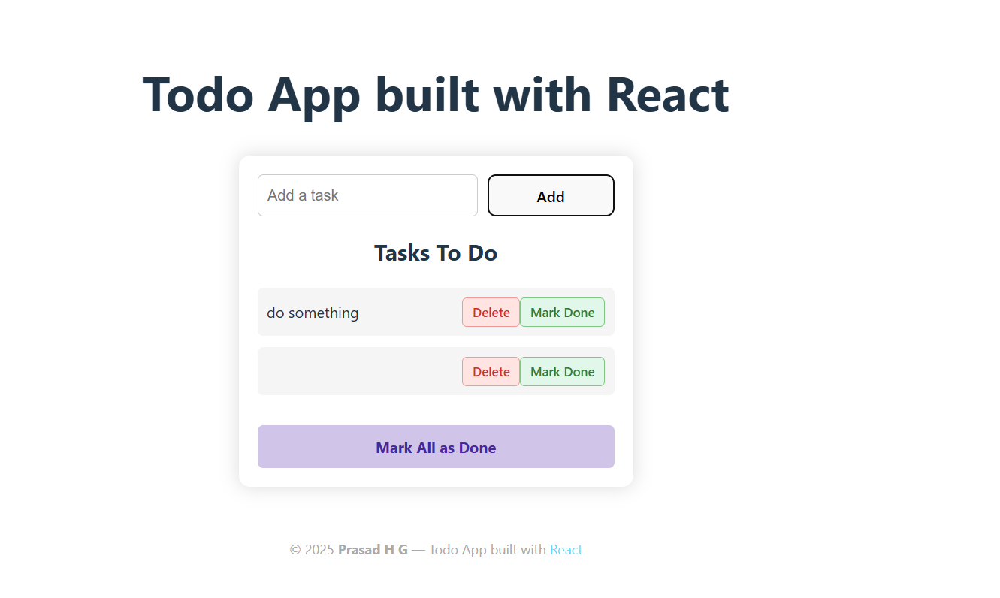

# 📝 Todo App — Built with React

A responsive and interactive Todo List application built using **React.js**. This project showcases React's core features such as state management with Hooks, list rendering, conditional styling, and modular component design.

---

## 🌐 Live Demo

▶️ [Click here to view the live app](https://Prasad-hg.github.io/Todo-react-app)

---
## 🚀 Features

- ✅ Add new tasks
- 🗑️ Delete individual tasks
- ✔️ Mark tasks as done (with strike-through effect)
- 🔁 Mark all tasks as completed
- 🎨 Beautiful UI with mobile-responsive design
- 🆔 Unique ID assignment with `uuid`
- ⚛️ Built with modern React (Functional components + Hooks)

---

## 📸 Screenshots

| Desktop View                             |
|------------------------------------------|
|     | 

---

## 🛠️ Tech Stack

| Tech           | Description                                 |
|----------------|---------------------------------------------|
| React.js       | Frontend library using functional components |
| CSS            | Custom styling + responsive layout          |
| uuid           | For generating unique IDs for todos         |
| Vite (optional) | Fast development server for React           |

---

## 📂 Project Structure

📦 react-state-app
├── 📁 public
├── 📁 src
│ ├── 📄 App.jsx
│ ├── 📄 TodoList.jsx
│ ├── 📄 TodoList.css
│ ├── 📄 index.css
│ └── 📄 main.jsx
├── 📄 package.json
└── 📄 README.md

---

## 📦 Installation & Run

Clone the repo and install dependencies:

git clone https://github.com/Prasad-hg/Todo-react-app.git
cd Todo-react-app
npm install
npm run dev   # or use: npm start if you're using CRA

🧪 How It Works

Uses useState for managing todo list and input
Each todo is an object: { id, task, isDone }
Tasks are displayed using .map()
Buttons call functions like markAsDone(), deleteTodo(), and markAllDone()
CSS handles mobile responsiveness via @media queries and flex-wrap

✨ Future Enhancements (Ideas)

⏳ Add due dates to tasks
📝 Edit task text inline
🔔 Notifications/reminders
🔒 Store tasks using localStorage or Firebase
🌗 Add dark mode toggle

🙋‍♂️ About Me
    Prasad H G
🔗 [GitHub](https://github.com/Prasad-hg)
🔗 [linkdin](https://www.linkedin.com/in/prasad-hg/)
📧 prasadhg2003@gmail.com
📘 LeetCode
🌐 Aspiring Software Developer | MERN Stack Learner | DSA Enthusiast

🧠 Acknowledgments

Built while learning React via self-practice & projects
Inspired by productivity and daily planner apps

📜 License

This project is open source and free to use for learning and development.

If you liked this project, please ⭐ the repo!